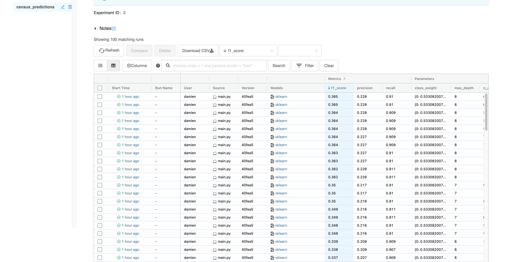

# us_census
The goal of this exercise is to model the information contained in the last column (42nd), i.e., which people make more or less than $50,000 / year, from the information contained in the other columns. The exercise here consists of modeling a binary variable.

### Local development
Python >= 3.8

```bash
virtualenv -p python3.8 venv
source venv/bin/activate
pip3 install -r requirements.txt

make run
```


### Trace:
- All results files are contained :[here](census_predictions/results/)
- Report on descriptive analysis is stored: [here](census_predictions/results/report.html)
- Log file is stored: [here](census_predictions/logs/census_predictions.log)
- Ml pipeline file is stored: [here](census_predictions/models/final_ml_pipeline.pkl)


Census prediction - V1

The descriptive analysis has been done with pandas profiling (and tfdv - on notebooks). 

MLPipeline is designed according the best practices of Scikit-learn. Basic feature engineering has been implemented:

- kbinsdiscretizer on numericals columns (number of bins set arbitrarily)
- one hot encoder on categorical columns (the initial objective was to mix label and one hot encoder according to the relation between the categories - lack of time)
- custom scikit transformer has been implemented : it's a target encoding with bayesian approach (to avoid overfit)

The experiments have been tracked with the mlflow tracking api combined with optuna for a fast hyperparameter optimisation



The model used is a randomforest classifier : as this model works with thresholds, the outliers treatments hasn't been prioritized

Clear improvements : 

- A lot of numerical columns has a high percentage of 0 : a deeper analysis has to be conducted to deal with this issue
- A lot of categorical columns has to much categories (high cardinality) : custom treatment has to be implemented instead of a one hot encoding for all columns
- Some columns are redundant and add white noises in the model learning


### To do :
- [try using poetry instead of pip](https://nanthony007.medium.com/stop-using-pip-use-poetry-instead-db7164f4fc72)
- [Implement unit test and data validation with pytest and great expectations](https://greatexpectations.io/)
- Implement Github Actions
- Implement isolate and reproducible environment with MLflow project API (and docker)
- Refactoring docstring of scripts
- add hinting on python function
- use pylint 
- add setup for packaging 
